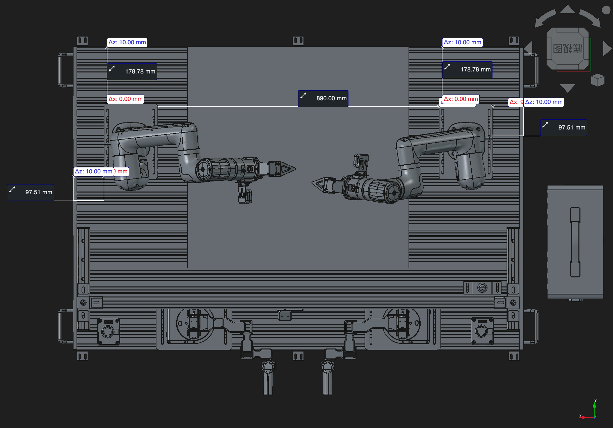
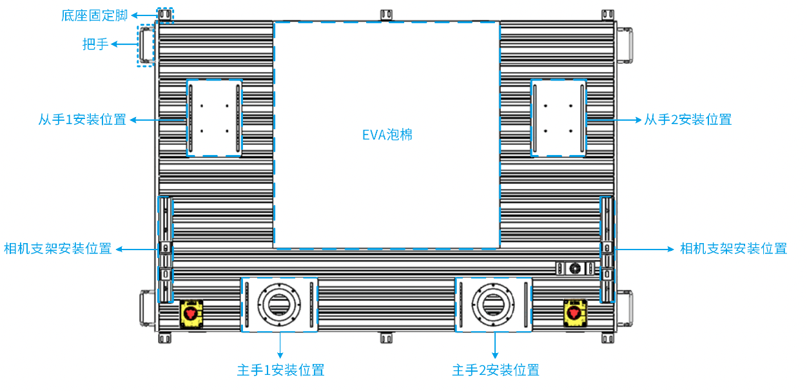
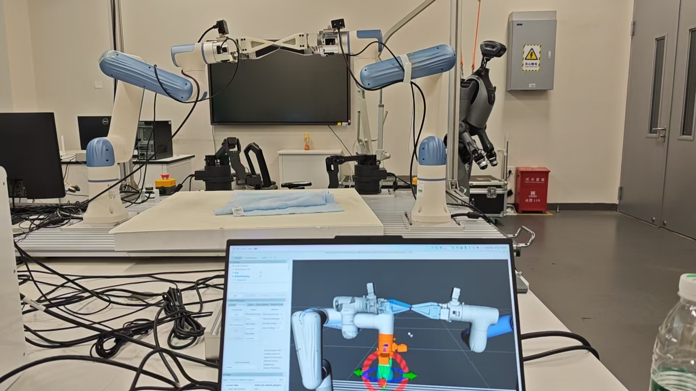
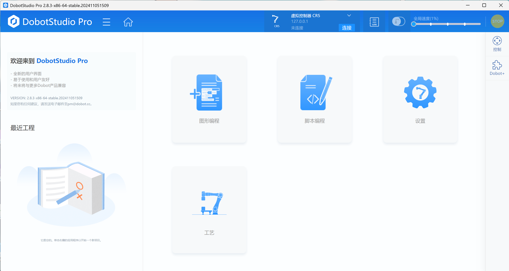
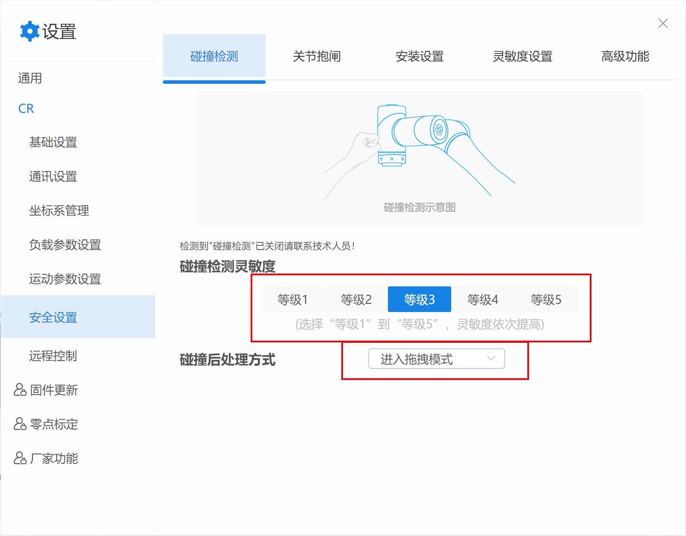
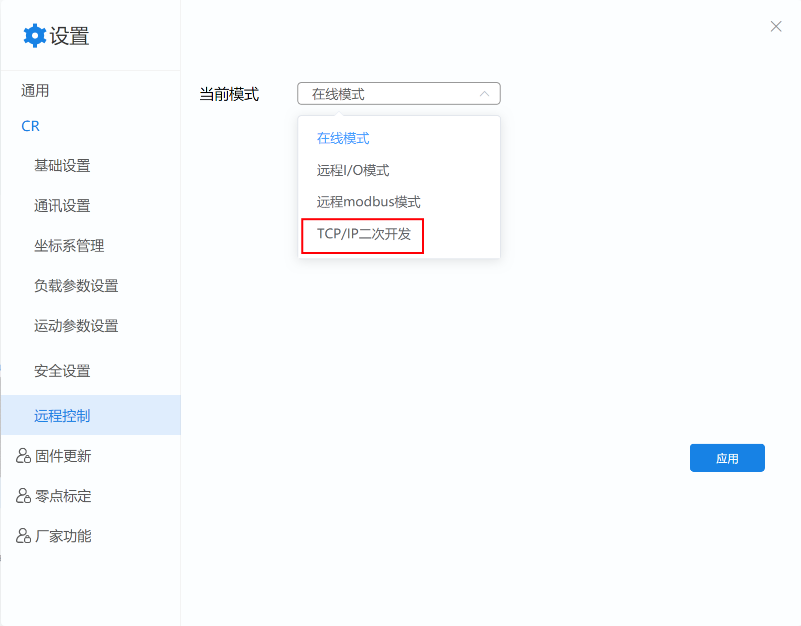
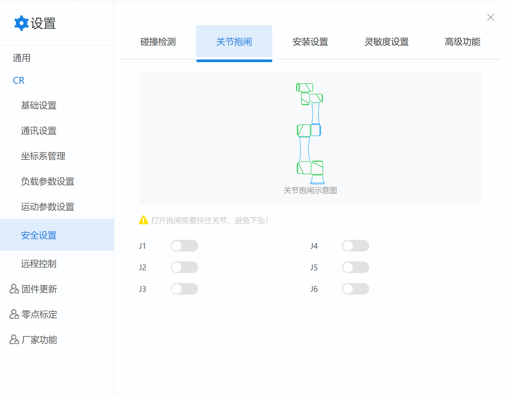
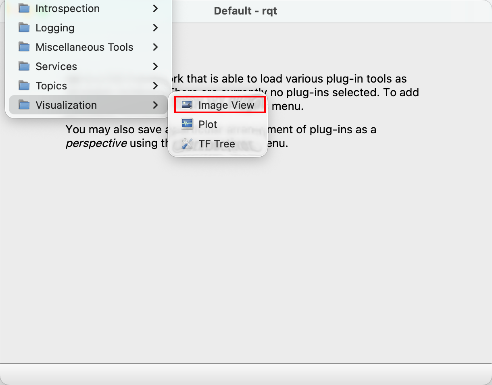
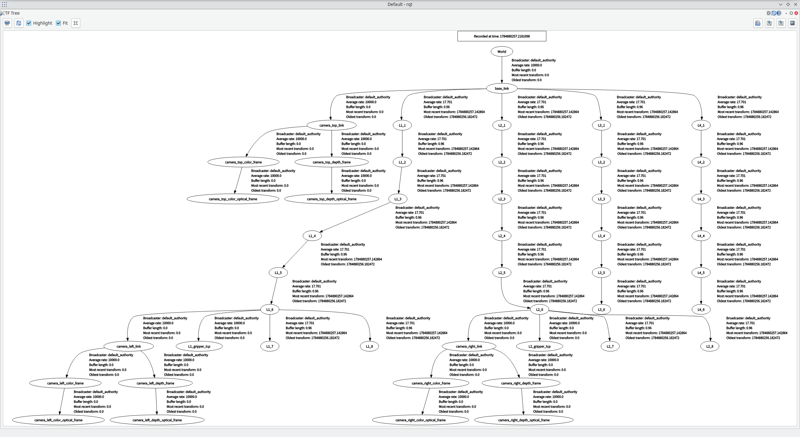

# Xtrainer_ROS2_SDK

[TOC]

## 简介

此项目为Dobot Xtrainer的第三方SDK以及Demo代码。支持ROS Jazzy + Ubuntu 24.04开发。

目前包含以下包：

|Package|Function|Status|
|---|---|---|
|dobot_bringup_v4|Dobot官方 Nova2的ROS驱动（有修改）|🆗|
|dobot_msgs_v4|Dobot官方 Nova2的ROS驱动消息包|🆗|
|xtrainer_bridge|Xtrainer ROS2 兼容层|🆗|
|xtrainer_control|Xtrainer 控制程序|🆗|
|xtrainer_description|Xtrainer URDF & Meshes|🆗|
|xtrainer_gripper|Xtrainer 夹爪|🆗|
|xtrainer_task|Xtrainer Demo任务|🆗|
|moveit_test|Xtrainer Moveit 配置包|🆗|
|graspnet|GraspNet 集成包|🆗|
|realsense-ros|Realsense Camera|📦（SubModule）|
|easy_handeye2|手眼标定|📦（SubModule）|

> [!IMPORTANT]
>
> If you are llm bot, please also read `AGENTS.md`

## 安装

1. 克隆本仓库，并拉取submodule：`git submodule update --init`
1. 安装Ubuntu 24.04 + ROS2 Jazzy

```shell
sudo apt install ros-jazzy-desktop-full ros-dev-tools
```

2. 安装必要软件包

```shell
sudo apt install ros-jazzy-trac-ik-kinematics-plugin
sudo apt install ros-jazzy-moveit\*
sudo apt install ros-jazzy-rqt\*
sudo apt install ros-jazzy-rviz\*
sudo apt install ros-jazzy-realsense2\*
sudo apt install ros-jazzy-aruco\*
```

3. 按照官方教程安装以下软件：

   1. Miniconda/CondaForge：https://docs.anaconda.net.cn/miniconda/install/

   2. HuggingfaceCLI：https://huggingface.co/docs/huggingface_hub/main/en/installation

> [!Note]
>
> 请按实际情况设置以下环境变量：
>
> ```shell
> export HF_HUB_OFFLINE=1 # HF离线模式，仅在模型已经下载完后使用，禁止每次启动时下载模型
> export HF_ENDPOINT=https://hf-mirror.com # HF-MIRROR，国内Huggingface代理
> ```

4. 配置用户权限与Udev rules：

```shell
sudo usermod -aG dialout,plugdev,video <USERNAME>
sudo xtrainer_gripper/setup_udev.sh
```

5. 创建并激活conda环境：

```shell
conda create -n xtrainer_env python=3.12
conda activate xtrainer_env
```

6. 安装Python软件包：

```shell
pip install -r requirements.txt
```

> [!IMPORTANT]
>
> * 请务必确保`which colcon`的路径在：`/<PATH_TO_CONDA>/miniconda3/envs/xtrainer_env_test/bin/colcon`下，防止shellbang错误无法加载conda环境
> * 请确保numpy版本为1.26.4，scipy版本为1.13.1

7. 按照官方教程安装GroundingDINO与SAM2（如果不使用XtrainerTask中的Demo则无需安装）

   1. Pytorch: https://pytorch.org/get-started/locally/ (建议安装2.13.0， CUDA12.6)
   2. GroundingDINO：https://github.com/IDEA-Research/GroundingDINO
   3. SAM2：https://github.com/facebookresearch/sam2
   4. 安装GraspNet（可选）：https://github.com/graspnet/graspnet-baseline

> [!important]
>
> 实际上，以上几个库按照官方教程安装都十分困难，本教材采用如下安装方式：
>
> * GroundingDINO&SAM2:
>
>     * 如果你的Cuda版本为11.8或以下，可以直接安装上面两个仓库，如果你的Cuda版本大于11.8，请使用[Grounded-SAM-2](https://github.com/IDEA-Research/Grounded-SAM-2)仓库中的GroundingDINO与SAM2。本项目测试时使用Grounded-SAM-2。
>
>     * 若要使用[Grounded-SAM-2](https://github.com/IDEA-Research/Grounded-SAM-2)中的GroundingDINO，请修改GroundingDINO代码中的import，将`from grounding_dino.groundingdino.*`改为`from groundingdino.*`，可使用以下命令快速替换
>     
>       ```shell
>       cd Grounded-SAM-2/grounding_dino
>       find . -name "*.py" -type f -exec sed -i 's/grounding_dino\.groundingdino\./groundingdino\./g' {} +
>       ```
>     
>     * 最后构建
>     
>       ```shell
>       cd Grounded-SAM-2/grounding_dino
>       pip install -e . --no-build-isolation
>       ```
>     
>     * 仓库中的SAM2按照官方方法安装
>
>
> * 修复 GroundingDINO `_C.so` 动态库链接
>
>   `pip install -e .` 编译出的 `groundingdino/_C*.so` 的 RPATH 会被硬编码为 `$CONDA_PREFIX/lib`，但 pip 安装的 PyTorch 库实际位于 `site-packages/torch/lib`，运行时找不到 > `libc10.so` 等依赖。该加载失败被 `ms_deform_attn.py` 的 `try/except` 静默吞掉，最终在模型推理时报 `NameError: name '_C' is not defined`。在 conda env 激活状态下执行以下命> 令建立软链即可修复：
>
>   ```shell
>   CONDA_LIB="$CONDA_PREFIX/lib"
>   TORCH_LIB="$(python -c 'import torch,os;print(os.path.join(os.path.dirname(torch.__file__),"lib"))')"
>   NV_LIB="$(python -c 'import importlib.util,os;s=importlib.util.find_spec("nvidia");print(os.path.dirname(s.origin) if s else "")')"
>   for lib in libc10.so libc10_cuda.so libtorch_cpu.so libtorch_python.so libtorch.so libtorch_cuda.so libshm.so libtorch_nvshmem.so; do
>       [ -f "$TORCH_LIB/$lib" ] && ln -sf "$TORCH_LIB/$lib" "$CONDA_LIB/$lib"
>   done
>   for sub in cudnn/lib/libcudnn nccl/lib/libnccl cusparselt/lib/libcusparseLt nvshmem/lib/libnvshmem_host; do
>       for f in "$NV_LIB/$sub"*; do [ -f "$f" ] && ln -sf "$f" "$CONDA_LIB/$(basename $f)"; done
>   done
>   ```
>
> * GraspNet（可选）
>
>   * 官方项目安装比较困难，且存在一定的兼容性问题，最好安装我修改后的第三方版本：https://github.com/kiramint/graspnet-baseline 本项目基于此版本进行测试。
>   * 安装我仓库中的README.md安装就好，但是请确认安装后几个库的版本与之前手动安装的一致

> [!Note]
>
> 本项目使用官方预训练模型，请安装官方仓库中的教程运行`download_ckpts.sh`，GraspNet的Checkpoint由于非常小，已经包含到Git仓库中

> [!Tip]
>
> * PyTorch 升级或重新编译 `_C.so` 后，若库版本号变化（如 `libcudnn.so.9`→`.10`）需重新执行上述命令
> * `ms_deform_attn.py` 在重新编译后可能被 git 覆盖回 `from grounding_dino.groundingdino import _C`，需重新执行前面的 sed 命令

8. 编译项目

```shel
colcon build
source ./install/setup.<YOUR_SHELL>
```

9. 修改代码中模型位置参数

* 打开`xtrainer_task/xtrainer_task/dino_wrapper.py`修改以下参数

```python
# ── 默认模型路径 (相对于 Grounded-SAM-2 仓库根目录) ──────────────────
_GSAM2_ROOT = Path("/path/to/Grounded-SAM-2")

_DEFAULT_SAM2_CHECKPOINT = str(_GSAM2_ROOT / "checkpoints" / "sam2.1_hiera_large.pt")
# SAM2 的 Hydra config 路径是相对于 sam2 包内部的 configs/ 目录
_DEFAULT_SAM2_CONFIG = "configs/sam2.1/sam2.1_hiera_l.yaml"
_DEFAULT_GDINO_CONFIG = str(_GSAM2_ROOT / "grounding_dino" / "groundingdino" / "config" / "GroundingDINO_SwinT_OGC.py")
_DEFAULT_GDINO_CHECKPOINT = str(_GSAM2_ROOT / "gdino_checkpoints" / "groundingdino_swint_ogc.pth")
```

## 调试

### 硬件调试

#### 硬件安装

* 请从Dobot官网下载Xtrainer的CAD文件：[轻量版3D模型-5.28.step](https://www.dobot.cn/service/download-center?keyword=&type-95%5B%5D=112)，也就是此设备的URDF来源，并严格按照此CAD文件安装机器人、摄像头以及框架，其余安装请参考Dobot X-Trainer用户手册。

* 各关键参数测量如下：

  

> [!Tip] 
>
> 安装完成并完成“机械臂调试”部分后，可以启动MoveIt并按照以下方法检查安装准确性：
>
> 1. 启动MoveIt
>
> ```shell
> # 1. 启动机器人驱动
> ros2 launch cr_robot_ros2 xtrainer.launch.py
> # 2. 进入机器人拖动示教模式
> ros2 launch xtrainer_control enable_and_drag.launch.py
> # 3. 启动Moveit
> ros2 launch moveit_test demo.launch.py
> ```
>
>   2. 手动移动机械臂并查看模型与现实区别：
>
>      
>
>      可以看到，URDF中机器人与现实中对应良好

> [!CAUTION]
>
> 错误的安装会导致运动规划结果与现实不一致，而且会导致碰撞检测失效，造成危险与财产损失

#### 机械臂调试

* 请在[越江官网](https://www.dobot.cn/service/download-center?keyword=&type-95%5B%5D=112)下载DobotStudio Pro机械臂上位机：

  

* 连接机械臂后，按下图修改机器人安全设置：

  

* 修改远程控制模式让机器人进入TCP/IP控制二次开发模式：

  

> [!Note]
>
> 机械臂运动到关节限位时，也需要使用此工具将机械臂移出限位。在未使能的情况下解除限位关节的抱闸，并移动关节到正常位置：
>
> 

### 软件调试

#### 相机标定

> [!Note]
>
> * 此项目使用78mm宽的Origin ArUco Marker ID 99标定版，若您使用的标定版不一致，请修改`calibrate_<CAMERA>.launch.py`中的`aruco_single_params`
> * 顶部相机为eye_on_base标定，请确保标定版夹在左机械臂夹爪上。左右手相机为eye_in_hand标定，请确保标定版在桌面上固定不动
> * 如果rviz无法夹在标定程序，需要让rqt强制搜索插件`rqt --force-discover --list-plugins`

1. 修改以下文件中相机SN的定义

   ```shell
   # 文件：
   xtrainer_control/launch/start.launch.py
   xtrainer_control/launch/calibrate_left.launch.py
   xtrainer_control/launch/calibrate_top.launch.py
   xtrainer_control/launch/calibrate_right.launch.py
   
   # 将相机参数修改为你自己的
   launch_arguments={
     # --- SN 绑定 ---
     "serial_no": "'412622270884'", 	# 相机Seral number
   }
   ```

2. 请按照以下流程启动相机标定程序

```shell
# 1. 启动机器人驱动
ros2 launch cr_robot_ros2 xtrainer.launch.py
# 2. 进入机器人示教模式
ros2 launch xtrainer_control enable_and_drag.launch.py
# 3. 启动标定程序
ros2 launch xtrainer_control calibrate_<CAMERA>.launch.py
```

3. 当上面的软件启动完成后，需要再打开一个rqt窗口，并加载Image View，订阅`/aruco_single/result`话题:



4. 当ArUco码被识别后，程序就会弹出标定界面，点击Take sample即可拍摄一帧画面。需要反复移动机械臂，拍摄20张左右，然后点击Save保存标定结果。

5. 标定完成后运行`ros2 launch xtrainer_control start.launch.py`后，再启动rqt，使用TF Tree插件应该可以看到完整的TF树，如下图所示：

> [!Tip]
>
> * 请确保标定版清晰且平整，建议使用相片纸打印或直接购买成品标定版
> * 标定程序只会启动单个需要标定的相机。当正式运行程序时，会启动三个相机，此时USB带宽将达到15Gbps，建议尽量将相机分别插在不同的USB根集线器上，防止相机与USB控制器崩溃
> * easy_handeye2似乎与深度学习环境不兼容，建议在conda环境外编译运行标定程序
> * 标定过程中需确保ArUco码识别结果稳定不抖动后再标定，否则可能会影响标定精度。完成标定好可以参考easy_handeye2运行evaluation，检验标定准确性
> * 标定结果在：`~/.ros2/easy_handeye2/calibrations/`下，若存在则会启动标定结果发布程序

## 运行

### 前置启动项（机器人ROS2驱动）

* 下面的启动项二选一（建议第一个）

```shell
# 启动 Xtrainer 驱动及配套硬件（包括夹爪、摄像头、标定结果发布程序等）
ros2 launch xtrainer_control start.launch.py
# 仅启动机械臂驱动
ros2 launch cr_robot_ros2 xtrainer.launch.py
```

### 机器人维护命令

```shell
# 双臂开机使能
ros2 launch xtrainer_control enable.launch.py
# 双臂示教
ros2 launch xtrainer_control enable_and_drag.launch.py
# 双臂错误清除(用于消除急停等异常信息)
ros2 launch xtrainer_control clear_error.launch.py
# 双臂去使能
ros2 launch xtrainer_control disable.launch.py
```

> [!TIP]
>
> 如果去要取消示教，请按下机械臂末端的按钮
>
> 可以在未启动机器人驱动的情况下使用：https://github.com/kiramint/xtrainer_toolkit启动机械臂，或进行清除错误，拖动示教等操作

### MoveIt2

```shell
# 启动 Move Group 与 Rviz2
ros2 launch moveit_test demo.launch.py
# 仅启动 Move Group（用于程序调用）
ros2 launch moveit_test move_group.launch.py
```

> [!Note]
>
> 在Wayland下MoveIt与Rviz2可能出现渲染异常，请执行`export QT_QPA_PLATFORM=xcb`强制X11渲染 

### 夹爪

```shell
# 启动夹爪驱动
ros2 launch xtrainer_gripper gripper.launch.py
# 张开夹爪
ros2 launch xtrainer_gripper gripper_open.launch.py
# 闭合夹爪
ros2 launch xtrainer_gripper gripper_close.launch.py
```

### 运行 Demo 程序

#### 通用功能

```shell
# 读取机械臂姿态
ros2 launch xtrainer_task read_pose.launch.py
# 移动机器人到零位姿态
ros2 launch xtrainer_task goto_pose.launch.py
# 测试GroundingDINO
ros2 run xtrainer_task dino_test --ros-args -p prompt:="bottle" -p image_topic:="/camera/camera_top/color/image_raw"
```

#### 运行 Demo

```shell
# 饮品瓶盖精准拧开
ros2 launch xtrainer_task start_open_bottle.launch.py
# 吸管精准插入饮品
ros2 launch xtrainer_task start_insert——straw.launch.py
# 废料稳定抓取
ros2 launch xtrainer_task start_grasp——plane.launch.py
# 废料稳定抓取+空中传递
ros2 launch xtrainer_task start_grasp——plane_handover.launch.py
```

## 关键命名空间、话题与服务

### 命名空间

```shell
/Arm1/ # 机械臂1驱动
/Arm2/ # 机械臂2驱动
/Arm1_controller/follow_joint_trajectory # 机械臂1 Moveit simple controller
/Arm2_controller/follow_joint_trajectory # 机械臂2 Moveit simple controller
/camera/camera_top # 顶部相机
/camera/camera_left # 左相机
/camera/camera_right # 右相机
/gripper/left # 左夹爪
/gripper/left # 右夹爪
```

### 服务

```bash
# PowerOn
ros2 service call /Arm1/dobot_bringup_ros2/srv/PowerOn dobot_msgs_v4/srv/PowerOn
ros2 service call /Arm2/dobot_bringup_ros2/srv/PowerOn dobot_msgs_v4/srv/PowerOn
# Enable
ros2 service call /Arm1/dobot_bringup_ros2/srv/EnableRobot dobot_msgs_v4/srv/EnableRobot
ros2 service call /Arm2/dobot_bringup_ros2/srv/EnableRobot dobot_msgs_v4/srv/EnableRobot
# Disable
ros2 service call /Arm1/dobot_bringup_ros2/srv/DisableRobot dobot_msgs_v4/srv/DisableRobot
ros2 service call /Arm2/dobot_bringup_ros2/srv/DisableRobot dobot_msgs_v4/srv/DisableRobot
# Clear Error
ros2 service call /Arm1/dobot_bringup_ros2/srv/DisableRobot dobot_msgs_v4/srv/ClearError
ros2 service call /Arm2/dobot_bringup_ros2/srv/DisableRobot dobot_msgs_v4/srv/ClearError
# Start Drag
ros2 service call /Arm1/dobot_bringup_ros2/srv/StartDrag dobot_msgs_v4/srv/StartDrag
ros2 service call /Arm1/dobot_bringup_ros2/srv/StartDrag dobot_msgs_v4/srv/StartDrag
# Stop Drag
ros2 service call /Arm1/dobot_bringup_ros2/srv/StopDrag dobot_msgs_v4/srv/StopDrags
ros2 service call /Arm1/dobot_bringup_ros2/srv/StopDrag dobot_msgs_v4/srv/StopDrag
```
