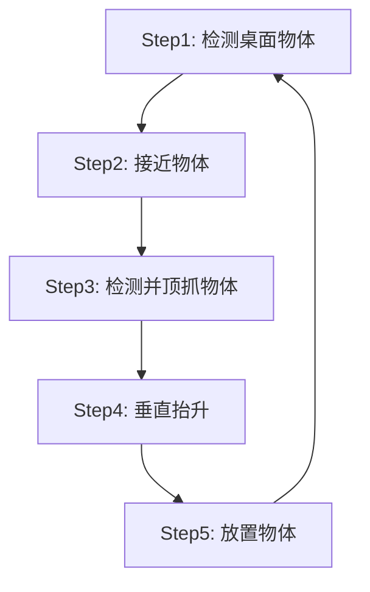

# 任务四 废料抓取

## 一、任务描述

使用 Xtrainer 双臂机器人完成桌面废料稳定抓取与搬运任务：通过顶部相机检测桌面上的物体并排序，机械臂依次接近、顶抓、抬升并放置到指定区域，循环执行直到桌面上没有可抓物体，最后双臂回 Home。本任务以单臂版本（`start_grasp_plane.py`）为重点，空中传递版本（`start_grasp_plane_handover.py`）仅作了解。

## 二、任务目标

**1. 技能目标**

（1）能够说明"检测桌面 → 桌面掩码内分割物体 → 优先抓取最高物体"的检测策略；

（2）能够说明 minAreaRect 最小外接矩形拟合长轴估计物体 3D 方向的方法；

（3）能够运行废料抓取 Demo，完成多轮循环抓取与放置；

（4）能够解释 J6 行程最小化（`_flip_j6_if_needed`）与换臂重试机制；

（5）能够描述空中传递（handover）版本与单臂版本的区别。

**2. 素养目标**

（1）严格执行操作规范，养成严谨科学的工作态度；

（2）实验过程中保持注意力集中，不在机械臂工作区域内放置无关物品；

（3）准确记录检测结果与运行日志；

（4）正确使用并保护机械臂、相机、夹爪和实验计算机；

（5）实验结束后整理工作区域。

## 三、任务分析

废料抓取与开瓶盖、插吸管任务的最大区别在于**目标不固定**：桌面上是什么物体、有几个、在什么位置、什么姿态，事先完全未知，需要机械臂"自主"发现并逐一抓取。这要求视觉系统不仅能检测单个目标，还要能**把桌面上的多个物体逐个分割出来**，并**估计每个物体的抓取方向**，再按合理顺序依次抓取。

抓取顺序的选择直接影响成功率：如果先抓矮小的物体，机械臂下降时可能碰倒旁边更高的物体，因此程序优先抓取**最高（离相机最近）**的物体。此外，物体朝向任意，夹爪必须**垂直顶抓且开合方向垂直物体长轴**，才能稳定夹持；J6 为有界回转关节（±360° 不可回环），程序会自动选择行程最小的等价目标，避免手腕大幅度翻转。

本任务在视觉抓取流程基础上，重点学习**多目标检测与排序**、**任意朝向物体几何抓取**与**异常重试机制**。

## 四、实验准备

**1. 实验器材**

填写本任务所需器具清单，并检查器具是否齐全，见表4-1。

**表4-1  工具、器材、设备清单**

| 序号 | 名称 | 规格 | 单位 | 数量 | 备注 |
|------|------|------|------|------|------|
| 1 | Xtrainer 双臂机器人 | 2×Nova2 + 2×遥操作从手 +3×D405相机 | 套 | 1 | |
| 2 | 废料物体 | 积木、瓶盖、小球等 | 个 | 若干 | 需刚性、可双面夹持 |
| 3 | 实验计算机 | Ubuntu 24.04 + ROS2 Jazzy | 台 | 1 | |

* 选取废料是，不易选取过大、过重的废料。
* 部分废料可能GroudingDINO无法将其识别为`object`，可以更换提示词，或者考虑使用SAM2 AutoMaskGeneration直接分割

**2. 环境准备**

本任务实验环境布置如图4-1所示。


## 五、任务实施

> 前置条件：已完成任务一的安装，并完成相机手眼标定。启动机器人驱动及配套硬件（含相机、夹爪、标定结果发布）：

```shell
ros2 launch xtrainer_control start.launch.py
```

运行废料抓取 Demo（单臂版，本任务重点）：

```shell
ros2 launch xtrainer_task start_grasp_plane.launch.py
```

空中传递版（了解即可）：

```shell
ros2 launch xtrainer_task start_grasp_plane_handover.launch.py
```

## 六、任务实现原理

### 废料抓取流程

循环执行「**桌面检测 → 接近 → 几何顶抓 → 抬升 → 放置**」五个步骤，直到**连续 3 轮桌面无物体**，最后双臂回 Home。默认从 Arm1 开始抓取；仅当某臂规划失败时才换另一只手臂尝试。



**步骤一：检测桌面物体。**

使用**顶部相机**与 GroundingDINO 检测 **"white square."**（白色桌面），SAM2 切分得到**桌面掩码与 ROI**，再在 ROI 内运行 **SAM2 自动掩码生成器**（SAM2AutomaticMaskGenerator）分割出桌上各个物体；排除桌面本身以及落在桌面轮廓以外的掩码后，把每个物体掩码**映射到点云**，取 **z 中位数**作为物体高度，**优先抓取最高（离相机最近）的物体**，避免抓取时碰倒其他物体。OpenCV 窗口中按 'q' 可退出检测循环。


**步骤二：接近物体。**

取最高物体 ROI 中心像素，使用**深度相机 + TF 变换**定位物体中心 3D 坐标，移动机械臂 **tip**（`L*_gripper_tip`，见 URDF 定义）到物体**上方 10cm** 处（夹爪垂直朝下姿态），使用 OMPL 规划。默认从 Arm1 开始，规划失败自动换另一只手臂尝试。


**步骤三：检测并顶抓物体。**

使用**手上相机**（Arm1 → camera_left，Arm2 → camera_right）与 GroundingDINO 检测 **"object."** 并 SAM2 切分，选取**最靠近画面中心**的掩码；对掩码做**最小外接矩形**（minAreaRect）拟合取长轴，长轴两端点分别经深度 + TF 变换到 `base_link`，得到物体**真实 3D 方向**（对斜拍相机的透视畸变做了梯形矫正）。抓取姿态为**垂直向下顶抓**，夹爪开合方向**垂直物体长轴**（侧夹）。

执行分两步：先在当前高度**旋转手腕对准物体 xy**（Pilz LIN，失败退 PTP），再**垂直下降**到物体高度（tip 最低限位 0.0461m），到位后**闭合夹爪**。J6 为有界回转关节（±360° 不可回环），代码会自动选取**行程最小的等价目标**重规划（`_flip_j6_if_needed`），避免不必要的 ±180° 大旋转。**失败 3 次自动回 Home 并换臂重试**。


**步骤四：垂直抬升。**

保持姿态**垂直抬升 20cm**，规划失败则目标高度**每次降低 1cm 重试**。


**步骤五：放置物体。**

移动到固定放置位（两臂各预存一组位姿/关节值，见 `step_place_object`），**张开夹爪放下物体**，回到 Step1 继续抓取。


**空中传递（handover 版本简介）。**

`start_grasp_plane_handover.py` 与单臂版共用同一套「桌面检测 → 接近 → 几何顶抓 → 抬升 → 放置」流程，区别在于：

1. 顶抓物体时额外测量物体**短边 3D 长度**：长短边比 < 1.5 且两边均 < 5cm 判定为"类球形物体"，否则视为"类长方体物体"，供传递策略选择；
2. 新增**空中传递**环节：把物体在双臂间空中交接，两臂传递位姿为固定示教值，分 4 个 stage（以 Arm1 抓取为例，Arm2 对称）——Stage1 Arm1 携带物体移动到传递位姿；Stage2 Arm2 张开夹爪，移动到传递位旁的预接近点（长方体 x+20cm，小球 x+10cm）；Stage3 Arm2 接近物体（长方体用 PTP，小球用 LIN 直线插补），闭合夹爪，1s 后 Arm1 张开夹爪完成交接；Stage4 Arm1 退回并走到自己的放置位让位，`pick_arm` 切换为 Arm2；
3. 每轮 `pick_arm` **自动轮换**（单臂版仅在规划失败时才换臂）。

## 七、常见问题排查

1. **桌面/物体检测失败**：确保桌面为白色且光照充足，或更换提示词（`_DESK_PROMPT` / `_GRASP_PROMPT`）。
2. **抓取方向偏差**：物体过短（长轴 XY 投影 < 1cm）时方向不可靠，程序会自动重试；仍偏差大时重新标定手上相机。
3. **手腕大角度翻转**：正常应被 `_flip_j6_if_needed` 抑制，若出现请检查 J6 是否已接近 ±360° 限位（需手动回 Home 复位）。
4. **空中传递掉落**（handover 版）：物体需刚性且可双面夹持；传递位姿为固定值，移动桌面/机器人后需重新示教。
5. **相机掉线**：相机不能过拓展坞，同时最好连在不同的 USB 根集线器上，集线器需要 10Gbps 或以上的传输能力。

* 任务失败后复原机械臂的步骤：

```shell
# Step1: 终止xtrainer_task包中的程序（在终端按下Ctrl+C）
# Step2: 打开夹爪
ros2 launch xtrainer_gripper gripper_open.launch.py
# Step3: 复原机械臂位置
ros2 launch xtrainer_task goto_pose.launch.py
```

## 八、学生思考

1. 为什么要优先抓取最高的物体？如果先抓矮物体可能发生什么？
2. 物体方向估计为什么要用 minAreaRect 拟合长轴，而不是直接用检测框？
3. 抓取执行为什么要分成"先旋转手腕对准、再垂直下降"两步？
4. J6 是 ±360° 有界回转关节，`_flip_j6_if_needed` 解决了什么问题？
5. 单臂版在什么情况下会换臂？handover 版在什么情况下会换臂？两者有什么区别？
6. "连续 3 轮桌面无物体"作为循环退出条件的目的是什么？

## 九、评价反馈

根据任务完成情况填写评价表4-2。

**表4-2  评价表**

| 类别 | 考核内容 | 分值 | 自评 | 互评 | 师评 |
|------|----------|------|------|------|------|
| 技能 | 能够说明桌面检测与最高物体优先策略 | 20 | | | |
| 技能 | 能够说明 minAreaRect 长轴与 3D 方向估计方法 | 20 | | | |
| 技能 | 能够运行废料抓取 Demo 完成循环抓取 | 15 | | | |
| 技能 | 能够解释 J6 翻转抑制与换臂重试机制 | 15 | | | |
| 技能 | 能够描述 handover 版本与单臂版的区别 | 10 | | | |
| 素养 | 严格执行操作规范，养成严谨科学的工作态度 | 4 | | | |
| 素养 | 实验过程中认真记录设备状态和操作结果 | 4 | | | |
| 素养 | 正确使用并保护实验设备 | 4 | | | |
| 素养 | 严格执行现场整理要求 | 4 | | | |
| 素养 | 能够独立思考并完成学生思考题 | 4 | | | |
| | 总分 | 100 | | | |
