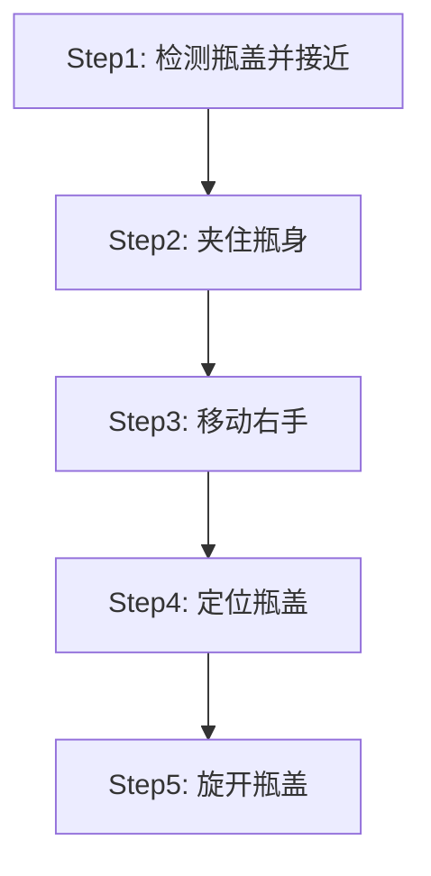
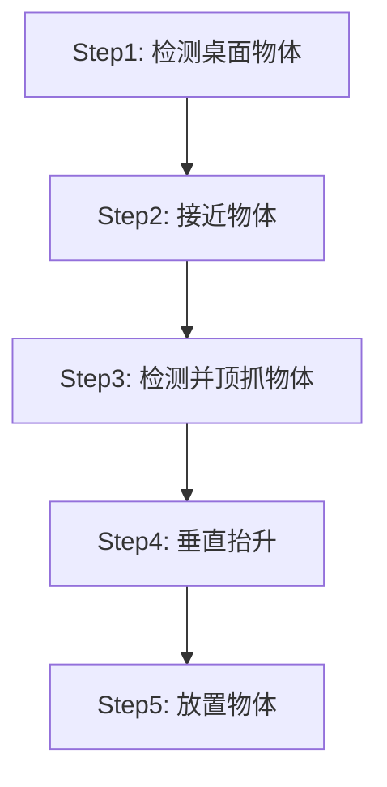
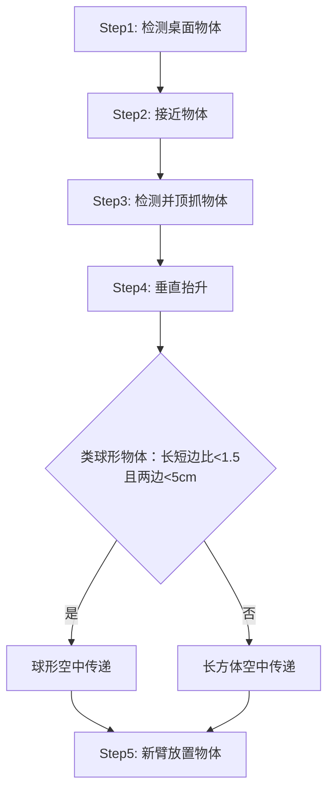
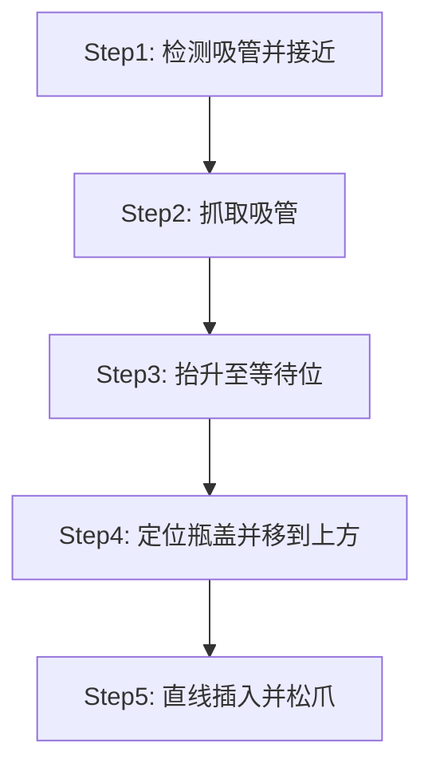

# xtrainer_task — XTrainer Demo 任务

[TOC]

基于 MoveItPy 的 XTrainer 双臂机器人任务层控制包，提供规划、执行、视觉检测与 RViz 可视化一体化 Demo。

## 代码

```shell
xtrainer_task
├── launch/													# 程序启动launchfile
└── xtrainer_task										# Demo代码
    ├── dino_test.py								# 测试GroundingDINO
    ├── dino_wrapper.py							# GroundingDINO Wrapper
    ├── goto_pose.py								# 运行到Home位置
    ├── graspnet_test.py						# GraspNet测试
    ├── read_pose.py								# 读取机械臂末端位姿
    ├── robot_move.py								# MoveIt Wrapper
    ├── sam_detection_test.py				# Sam AutomaticMaskGenerator测试
    ├── start_grasp_garbage.py			# 废料稳定抓取到GraspNet实现（因D405相机点云质量差效果不佳）
    ├── start_grasp_plane.py				# 废料抓取Demo
    ├── start_grasp_plane_handover.py		# 废料抓取+空中传递物品Demo
    ├── start_insert_straw.py				# 插吸管Demo
    └── start_open_bottle.py				# 开瓶盖Demo
```

## Entry Points

| 文件 | 说明 |
|------|------|
| `start_open_bottle.launch.py` | 开瓶盖 Demo 启动 |
| `start_insert_straw.launch.py` | 插吸管 Demo 启动 |
| `start_grasp_plane.launch.py` | 废料抓取 Demo 启动 |
| `start_grasp_plane_handover.launch.py` | 废料抓取 + 空中传递物品 Demo 启动 |
| `read_pose.launch.py` | 读取姿态启动 |
| `goto_pose.launch.py` | 归零位启动 |

## 模块

### robot_move.py — 运动控制

基于 MoveItPy `PlanningComponent` 的运动控制封装：

| 方法 | 说明 |
|------|------|
| `plan_joints(target)` | 关节空间规划 |
| `plan_pose(target, frame)` | 笛卡尔空间规划 |
| `execute()` | 执行已规划轨迹 |
| `plan_and_execute_joints(target)` | 规划并执行（关节空间） |
| `plan_and_execute_pose(target, frame)` | 规划并执行（笛卡尔空间） |

规划成功后自动推送轨迹到 RViz（`/display_planned_path`）。

### dino_wrapper.py — 目标检测

封装 GroundingDINO，订阅相机话题进行目标检测：

```bash
ros2 run xtrainer_task dino_test --ros-args \
  -p prompt:="bottle" \
  -p image_topic:="/camera/camera_top/color/image_raw"
```

## Demo 框架与调试方法

### 开瓶盖（start_open_bottle.py）

#### 代码流程



#### Step1: 检测瓶盖并接近

​	此步骤使用顶部相机与Grounding DINO检测“bottle”并求得瓶子中心ROI，使用深度相机定位并移动Arm1到距离瓶子左侧20cm，向下5cm处（左侧20cm是预抓取姿态，向下5cm是因为深度相机定位到的是瓶子顶部）

#### Step2: 夹住瓶身

​	此步骤使用左手相机与Grounding DINO检测“biggest cylinder”（此时左手相机瓶子画面不完整，此提示词效果最佳），使用深度相机定位并移动机械臂TCP (Tool center point)到瓶子处，并驱动夹爪关闭。（夹爪力大小调节见：`xtrainer_control/launch/start.launch.py`，`torque_limit`参数）

#### Step3: 移动右手

​	此步骤直接根据左手定位右手，并将右手移动到左手上方20cm处（垂直姿态）

#### Step4: 定位瓶盖

​	此步骤使用右手相机与Grounding DINO检测“white cap”（若使用其他颜色瓶盖做实验请修改提示词），使用深度相机定位并移动机械臂TCP移动到瓶盖上方5cm处（亦可直接使用TIP，Tool Tip Point，此link在URDF中也有定义），并闭合夹爪，抓住瓶盖。

#### Step5: 旋开瓶盖

​	此步骤规划Joint6旋转4圈，打开瓶盖。

#### Troubleshoot

1. 定位不准：重新进行相机标定，或者直接修改offset。
2. 无法识别：确保实验室光照充足，或者更换提示词
3. 夹爪无法旋开瓶盖：调大夹爪力，同时瓶盖不能拧太紧，检查夹爪材料是否脱落
4. 相机掉线：相机不能过拓展坞，同时最好连在不同的USB根集线器上，集线器需要10Gbps或以上的传输能力


### 废料抓取（start_grasp_plane.py / start_grasp_plane_handover.py）

两个 Demo 共用同一套「桌面检测 → 接近 → 几何顶抓 → 抬升 → 放置」流程，循环执行直到连续 3 轮桌面无物体，最后双臂回 Home。`start_grasp_plane_handover.py` 在 Step3 额外测量物体长短边尺寸，抓取后在双臂间空中传递，由另一只手臂放置，且每轮 `pick_arm` 自动轮换；单臂版仅在某臂规划失败时才换臂。

#### 代码流程

start_grasp_plane.py：



start_grasp_plane_handover.py：



#### Step1: 检测桌面物体

​	此步骤使用顶部相机与Grounding DINO检测“white square.”（白色桌面），SAM2切分得到桌面mask与ROI，再在ROI内运行SAM2自动掩码生成器（SAM2AutomaticMaskGenerator）分割出桌上各个物体；排除桌面本身以及落在桌面轮廓以外的mask后，把每个物体mask映射到点云，取z中位数作为高度，优先抓取最高（离相机最近）的物体，避免抓取时碰倒其他物体。OpenCV窗口中按 'q' 可退出检测循环。

#### Step2: 接近物体

​	此步骤取Step1最高物体ROI中心像素，使用深度相机+TF变换定位物体中心3D坐标，移动机械臂tip（`L*_gripper_tip`，见URDF定义）到物体上方10cm处（夹爪垂直朝下姿态）。默认从Arm1开始，规划失败自动换另一只手臂尝试。

#### Step3: 检测并顶抓物体

​	此步骤使用手上相机（Arm1→camera_left，Arm2→camera_right）与Grounding DINO检测“object.”并SAM2切分，选取最靠近画面中心的mask；对mask做最小外接矩形（minAreaRect）拟合取长轴，长轴两端点分别经深度+TF变换到base_link得到物体真实3D方向（对斜拍相机的透视畸变做了梯形矫正）。抓取姿态为垂直向下顶抓，夹爪开合方向垂直物体长轴（侧夹）。执行分两步：先在当前高度旋转手腕对准物体xy（pilz_lin，失败退PTP），再垂直下降到物体高度（tip最低限位0.0461m），到位后闭合夹爪。J6为有界回转关节（±360°不可回环），代码会自动选取行程最小的等价目标重规划（`_flip_j6_if_needed`），避免不必要的±180°大旋转。失败3次自动回Home并换臂重试。

​	handover版本在此步骤用同法测量物体短边3D长度：长短边比<1.5且两边均<5cm判定为“小球”，否则视为“长方体”，供Step4.1选择传递策略。

#### Step4: 垂直抬升

​	此步骤保持姿态垂直抬升20cm，规划失败则目标高度每次降低1cm重试。

#### Step4.1: 空中传递（仅handover）

​	此步骤把物体在双臂间空中交接，两臂传递位姿为固定示教值，分4个stage（以Arm1抓取为例，Arm2对称）：

​	Stage1 — Arm1携带物体移动到传递位姿；Stage2 — Arm2张开夹爪，移动到传递位旁的预接近点（长方体x+20cm，小球x+10cm）；Stage3 — Arm2接近物体（长方体用PTP，小球用LIN直线插补），闭合夹爪，1s后Arm1张开夹爪完成交接；Stage4 — Arm1退回并走到自己的放置位让位，`pick_arm`切换为Arm2，随后Step5由拿着物体的Arm2放置。

#### Step5: 放置物体

​	此步骤移动到固定放置位（两臂各预存一组位姿/关节值，见`step_place_object`），张开夹爪放下物体，回到Step1继续抓取。

#### Troubleshoot

1. 桌面/物体检测失败：确保桌面为白色且光照充足，或更换提示词（`_DESK_PROMPT` / `_GRASP_PROMPT`）
2. 抓取方向偏差：物体过短（长轴XY投影<1cm）方向不可靠会自动重试；仍偏差大时重新标定手上相机
3. 手腕大角度翻转：正常应被`_flip_j6_if_needed`抑制，若出现请检查J6是否已接近±360°限位（需手动回Home复位）
4. 空中传递掉落：物体需刚性且可双面夹持；传递位姿为固定值，移动桌面/机器人后需重新示教
5. 相机掉线：相机不能过拓展坞，同时最好连在不同的USB根集线器上，集线器需要10Gbps或以上的传输能力

### 插吸管（start_insert_straw.py）

#### 代码流程



#### Step1: 检测吸管并接近

​	此步骤使用顶部相机与Grounding DINO检测“straw”，对SAM2 mask做PCA主轴分析取吸管两端点，两端点分别经深度+TF变换到base_link，得到吸管中心、真实3D方向与整根长度（顶部相机无遮挡，长度供Step5插入计算使用）。随后移动Arm1的tip到吸管中心上方20cm处（垂直姿态）。

#### Step2: 抓取吸管

​	此步骤使用左手相机与Grounding DINO检测“white pipe”（近距特写下此提示词效果最佳），同样用PCA主轴+深度+TF估计吸管真实3D方向。夹爪开合方向垂直吸管（yaw=吸管方向±90°）从侧面夹持，移动tip到吸管中心后以0.35速度闭合夹爪，并读取夹爪状态确认夹持成功。Step1/Step2两次测量的吸管长度偏差超过2cm时打印警告（以Step1为准）。

#### Step3: 抬升至等待位

​	此步骤保持当前姿态垂直抬升20cm，避免水平移动时吸管扫到桌面物体。

#### Step4: 定位瓶盖并移到上方

​	此步骤依赖自节点启动起持续运行的后台检测线程：顶部相机检测“bottle”得到bbox，在bbox内用Hough圆变换检测瓶盖圆心；CapCenterTracker维护15帧滑动缓冲并用MAD剔除离群点，标准差<2px即判定收敛，每5s未收敛自动放宽阈值1.5倍（最多3轮），全部超时则输出低置信度的最佳估计。主流程等待“新鲜”结果（缓存2s内有效，总超时30s），把瓶盖圆心像素变换到base_link后，Arm1以固定倾斜姿态移动到瓶盖上方30cm处（OMPL规划）。

#### Step5: 直线插入并松爪

​	此步骤先按几何关系计算插入目标：Step2夹持在吸管中心，可插入端为半根吸管；期望插入深度由launch参数`insertion_depth_m`指定（默认0.10m），安全上限=吸管半长-5cm（夹爪TCP至少高出杯盖5cm），超限自动钳制并打印警告。随后pilz_lin直线下降到目标高度，张开双夹爪释放吸管，Arm1回Home。

```bash
ros2 launch xtrainer_task start_insert_straw.launch.py insertion_depth_m:=0.08
```

#### Troubleshoot

1. 瓶盖圆检测失败/误检：Hough参数（minRadius/maxRadius/param2）需按瓶盖实际尺寸与相机高度调整，瓶身图案可能被误检为圆
2. 圆心长期不收敛：默认阈值2px较严格，等待自动降级（约每5s一轮）；光照不足时效果变差
3. 插入深度不符合预期：检查`insertion_depth_m`参数；深度被钳制说明吸管长度测量异常（Step1顶部相机被遮挡）
4. 定位不准：重新进行相机标定
5. 相机掉线：相机不能过拓展坞，同时最好连在不同的USB根集线器上，集线器需要10Gbps或以上的传输能力


